# Screenshots

Captured from the Expo **web export** of the mobile app at iPhone 14 size (390×844 @2x, light
mode) against the API loaded with recorded fixtures and the demo seed. Native-only features
(camera, OCR, geofencing, push) show their permission/fallback states on web.

| | | |
| --- | --- | --- |
| 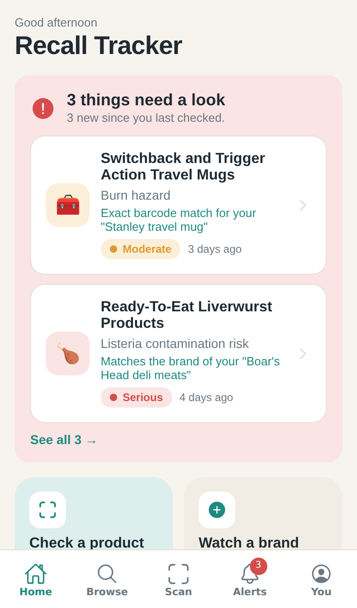 Home | 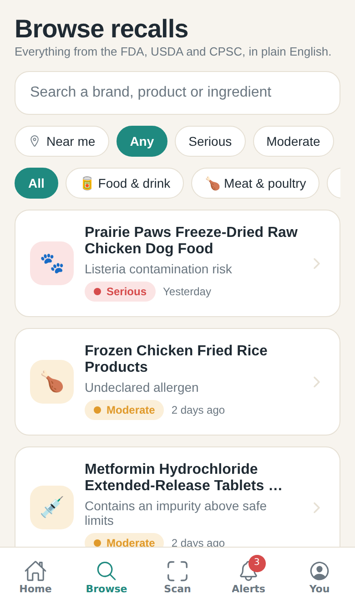 Browse | 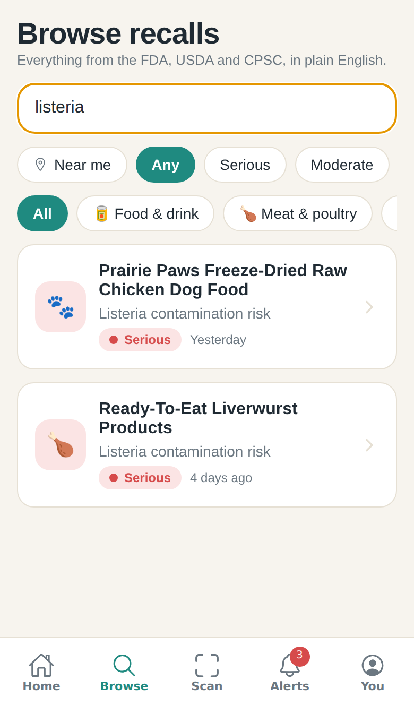 Search |
| 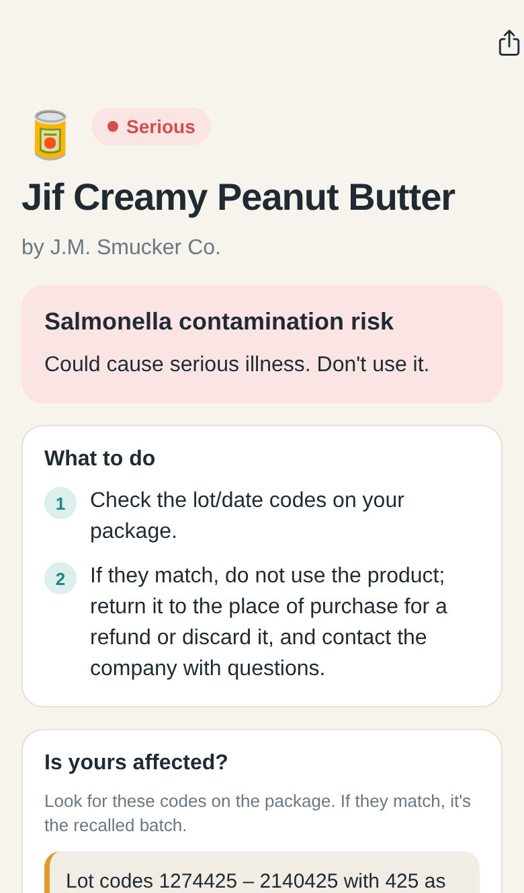 Recall detail | 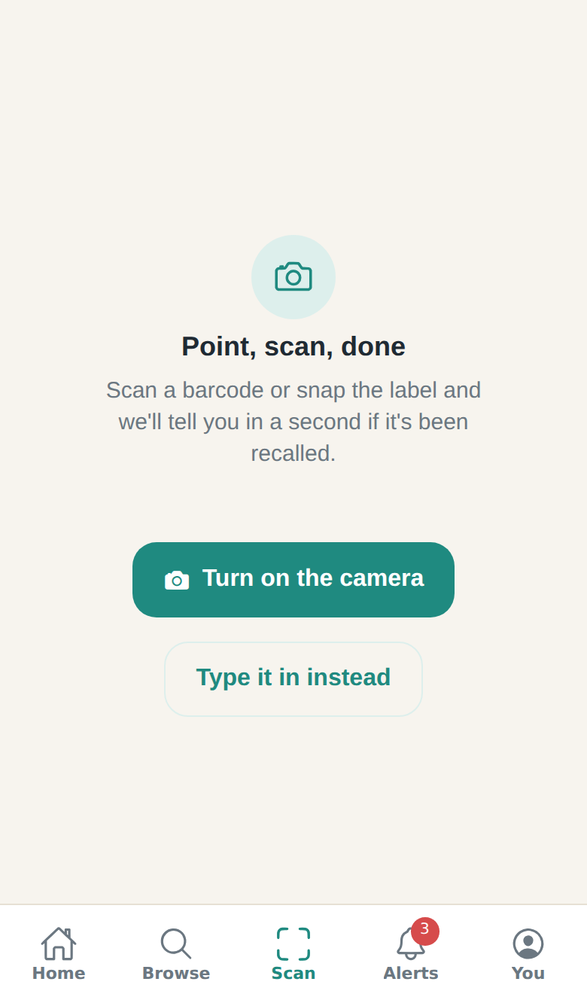 Scan | 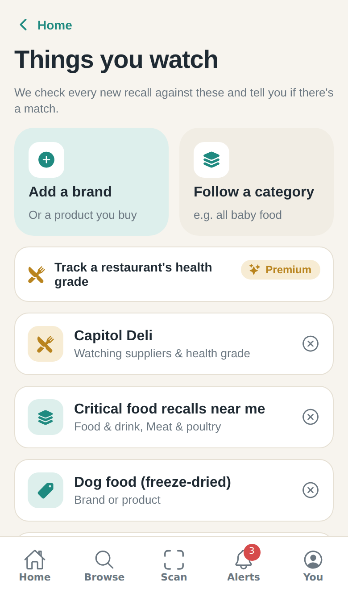 Things you watch |
| 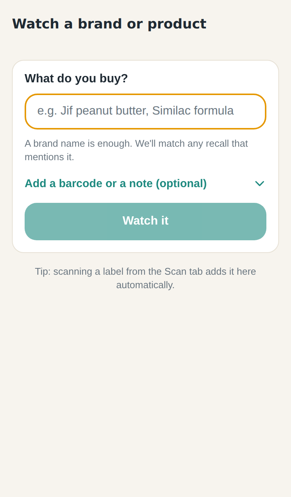 Add a brand | 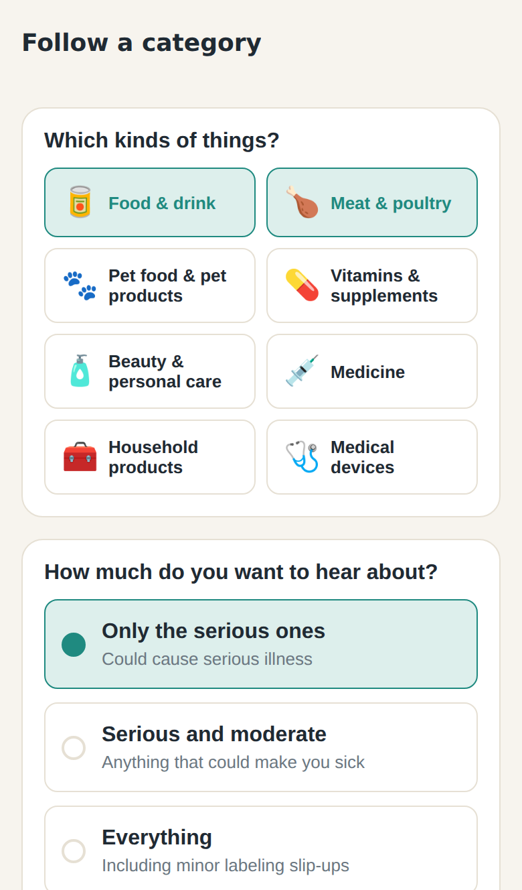 Follow a category | 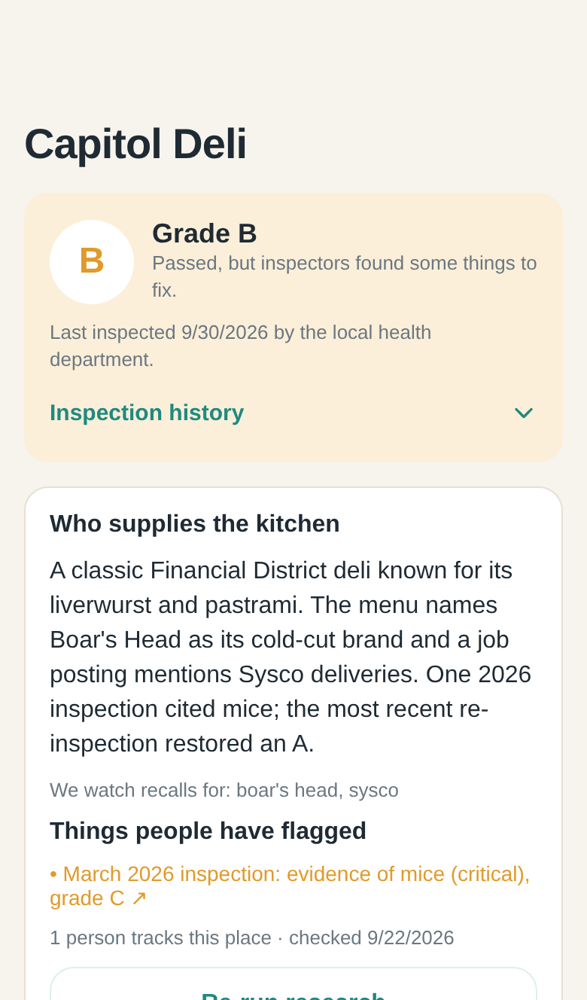 Restaurant + health grade |
| 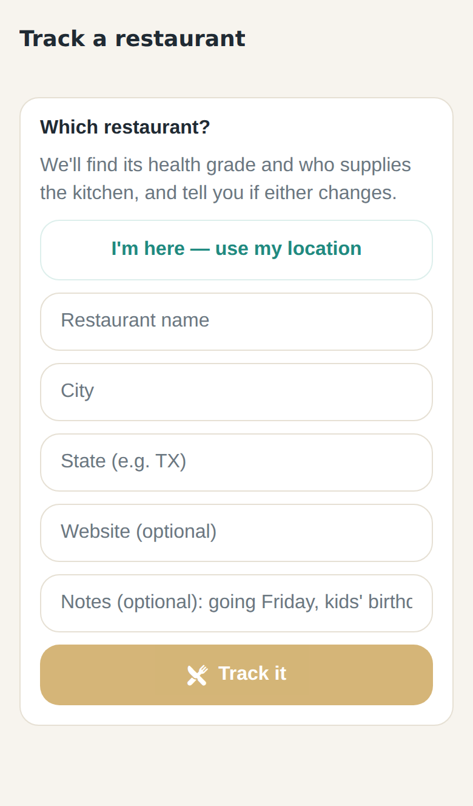 Add restaurant | 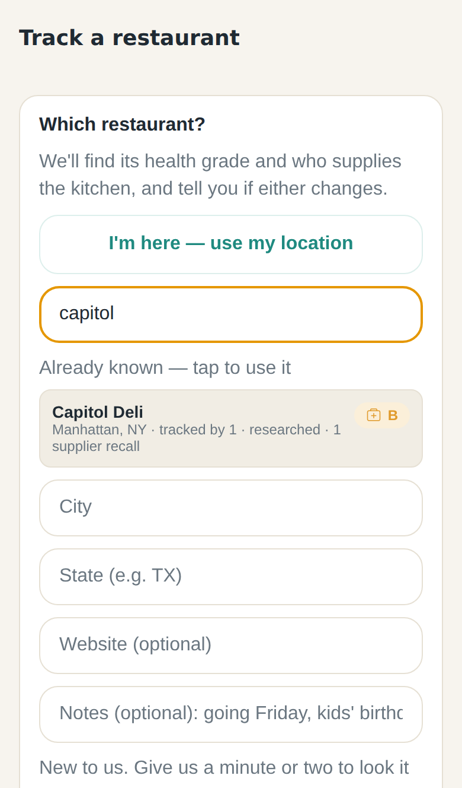 Catalog search | 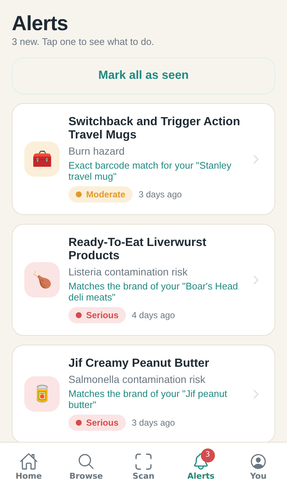 Alerts |
| 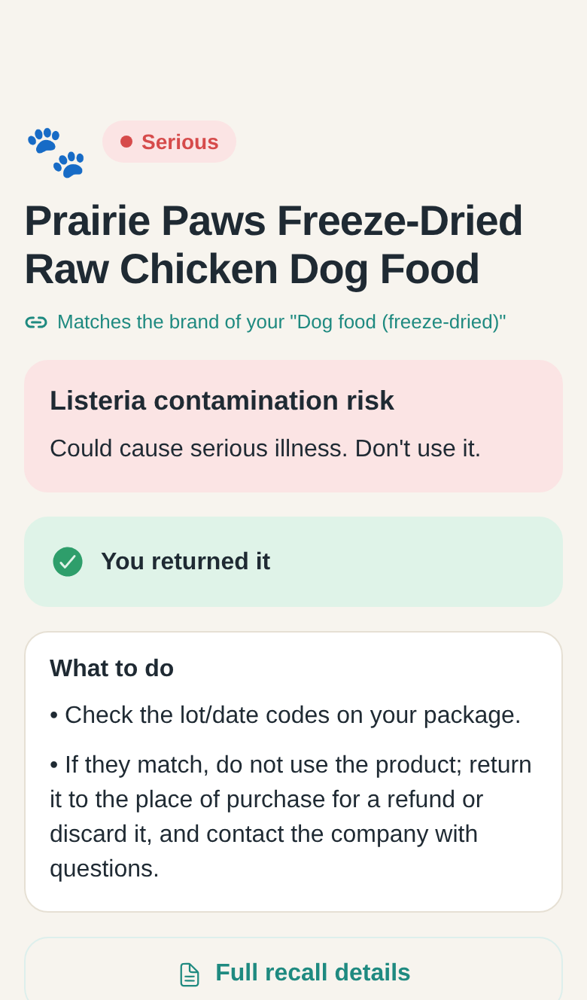 Alert detail | 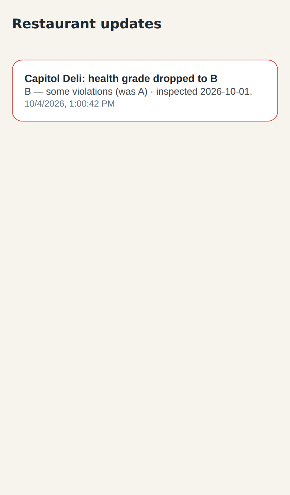 Restaurant updates | 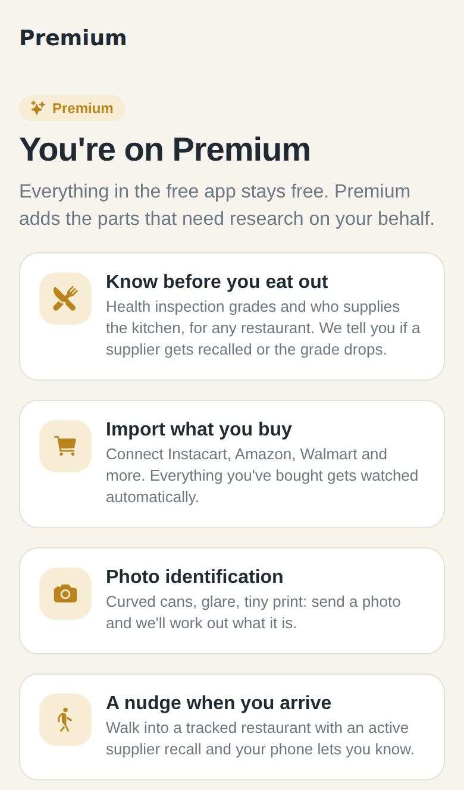 Premium |
| 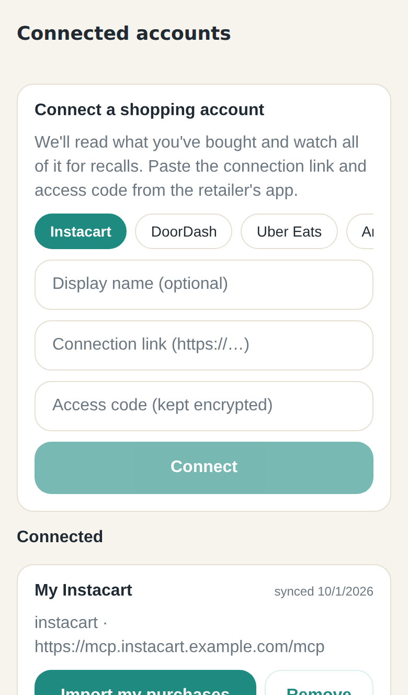 Connected accounts | 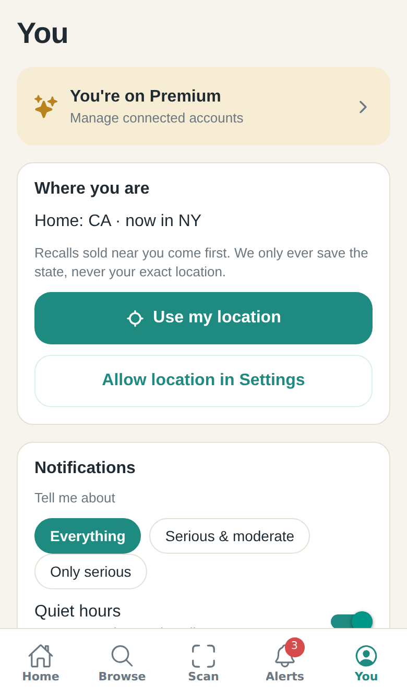 You | |

## Regenerate

```bash
# 1. API with fixture data + demo user (token: demo-token-for-screenshots)
cd apps/api
npm run ingest:fixtures
DEMO_TOKEN=demo-token-for-screenshots npm run seed:demo
INGEST_USE_FIXTURES=1 npm run dev          # port 4000

# 2. Web export of the app, served with SPA fallback
cd apps/mobile
EXPO_PUBLIC_API_URL=http://localhost:4000 npx expo export --platform web --output-dir dist
node scripts/serve-web-export.mjs dist     # port 8080

# 3. Capture (needs `playwright` + a Chromium: npx playwright install chromium)
node scripts/screenshots.mjs ../../docs/screenshots
```
